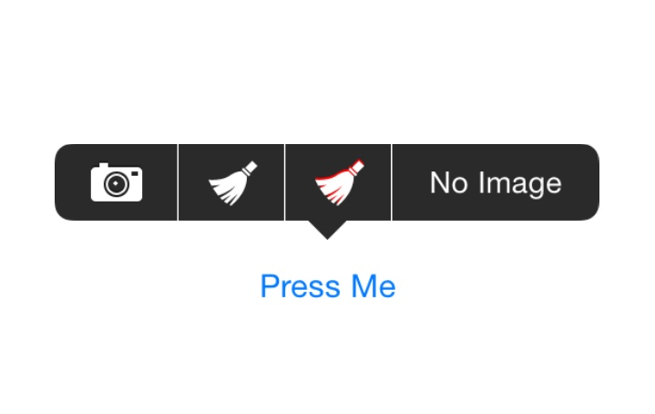

# UIMenuItem with Image Support

*Officially Deprecated! use [MenuItemKit](https://github.com/cxa/MenuItemKit) instead.*

`UIMenuItem` uses `UILabel` to display its title, that means we can swizzle `-drawTextInRect:` to support image.

`UIMenuItem+CXAImageSupport` is a dirty hack but should be safe in most cases. Contains no any private APIs and should be safe for App Store.

## How to use

*Xcode 7 required due to Objective-C generics.*

Drag `UIMenuItem+CXAImageSupport.{h,m}` to your project. Or drag `ImageMenuItem.xcodeproj` to your project and embed `ImageMenuItem` framework if you only support iOS 8.0 and above.

The method names describe all. For simple usage, the only step is to set a image to the menu item. For advance usage, config and set a `settings`.

    @class CXAMenuItemSettings;
    
    @interface UIMenuItem (CXAImageSupport)
    
    - (instancetype)initWithTitle:(NSString *)title action:(SEL)action image:(UIImage *)image;
    - (instancetype)initWithTitle:(NSString *)title action:(SEL)action settings:(CXAMenuItemSettings *)settings;
    - (void)cxa_setImage:(UIImage *)image;
    - (void)cxa_setSettings:(CXAMenuItemSettings *)settings;
    
    @end
    
    // Uses a settings class instead of NSDictionary to avoid
       misspelled keys
    @interface CXAMenuItemSettings : NSObject <NSCopying>

    + (instancetype)settingsWithDictionary:(NSDictionary<NSString *, id> *)dict;
    
    @property (nonatomic, strong) UIImage *image;
    @property (nonatomic) BOOL shadowDisabled;
    @property (nonatomic, strong) UIColor * __nullable shadowColor; // Default is [[UIColor blackColor] colorWithAlphaComponent:1./3.]
    @property (nonatomic) CGFloat shrinkWidth; // For adjustment item width only, will not be preciouse because menu item will keep its minimun width, it's useful for showing some large amount of menu items without expanding.
    
    @end
    
## Limitation

`UIMenuItem+CXAImageSupport` uses `UIMenuItem`'s title to map related image since there is no any other clue of `UIMenuItem` I can find to connect to `UILabel`. You can't set different images for the same title.

## About Me

* Twitter: [@_cxa](https://twitter.com/_cxa)
* Apps available in App Store: <http://lazyapps.com>
* PayPal: xianan.chen+paypal 📧 gmail.com, buy me a cup of coffee if you find it's useful for you.

## License

`UIMenuItem+CXAImageSupport` is released under the MIT license. In short, it's royalty-free but you must keep the copyright notice in your code or software distribution.
